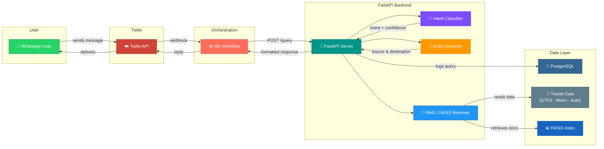

<p align="center">
  <h1 align="center">🚌 DelhiCommuteBot</h1>
  <p align="center">
    <strong>Your AI-powered Delhi commute assistant — right inside WhatsApp.</strong>
  </p>
  <p align="center">
    <a href="#-quick-start"></a>
    <a href="#-api-endpoints"></a>
    <a href="#-contributing"></a>
  </p>
  <p align="center">
    
    
    
    
    
    
    
    
  </p>
</p>

---

DelhiCommuteBot is a **WhatsApp-based conversational assistant** that helps commuters in Delhi find the best bus routes, metro connections, auto fares, and shared-auto options — all through natural language messages. It combines **intent classification**, **entity extraction**, and **Retrieval-Augmented Generation (RAG)** with FAISS vector search to deliver fast, accurate, and context-aware transit responses.

> 💬 *"How do I get from Rajiv Chowk to Huda City Centre?"*
> — Just text it on WhatsApp. DelhiCommuteBot handles the rest.

---

## 🏗️ Architecture



---

## ✨ Features

| Feature | Description |
|---------|-------------|
| 🗣️ **Natural Language Understanding** | Understands free-text queries like *"cheapest way from Dwarka to CP"* |
| 🎯 **Intent Classification** | Classifies into `bus_route`, `metro_route`, `auto_fare`, `shared_auto`, `compare`, `general` |
| 📍 **Entity Extraction** | Extracts source/destination from patterns like *"from X to Y"*, *"X se Y"* |
| 🔎 **RAG-Powered Retrieval** | FAISS + sentence-transformers for semantic search over transit documents |
| 🚇 **Multi-Modal Transit** | Covers Delhi buses (GTFS), metro, autos, and shared autos |
| 💰 **Fare Comparison** | Compare fares across transport modes side-by-side |
| 📱 **WhatsApp Integration** | Seamless chat experience via Twilio + n8n workflow automation |
| 📊 **Analytics Dashboard** | Query logs, top routes, intent breakdowns, and feedback summaries |
| 🔄 **Feedback Loop** | Users can rate responses (1–3) to improve quality over time |
| 🐳 **Dockerized Deployment** | One-command setup with `docker-compose` |

---

## 🛠️ Tech Stack

<table>
<tr>
<td><b>Category</b></td>
<td><b>Technology</b></td>
</tr>
<tr><td>🌐 API Framework</td><td>FastAPI 0.115.6 + Uvicorn</td></tr>
<tr><td>🤖 NLP / RAG</td><td>LangChain 0.3.14 · FAISS (faiss-cpu) · sentence-transformers 3.3.1</td></tr>
<tr><td>🗄️ Database</td><td>PostgreSQL 16 (asyncpg) · SQLAlchemy 2.0 · Alembic migrations · SQLite fallback (aiosqlite)</td></tr>
<tr><td>📱 Messaging</td><td>Twilio WhatsApp API · httpx</td></tr>
<tr><td>⚙️ Orchestration</td><td>n8n workflow automation</td></tr>
<tr><td>📊 Data Processing</td><td>pandas · NumPy · rapidfuzz · geopy</td></tr>
<tr><td>🔧 Config & Logging</td><td>pydantic-settings · Loguru</td></tr>
<tr><td>🐳 Infrastructure</td><td>Docker · docker-compose</td></tr>
</table>

---

## 📋 Prerequisites

Before you begin, ensure you have the following installed:

- **Python 3.11+** — [Download](https://www.python.org/downloads/)
- **Docker & Docker Compose** — [Install Docker](https://docs.docker.com/get-docker/)
- **Twilio Account** — [Sign up](https://www.twilio.com/try-twilio) (for WhatsApp integration)
- **Git** — [Install Git](https://git-scm.com/)

---

## 🚀 Quick Start

### Option 1: Docker Compose (Recommended)

The fastest way to get everything running — PostgreSQL, n8n, and the API — in one command.

```bash
# 1. Clone the repository
git clone https://github.com/Sanjeev2004/Delhi_Commute_Bot.git
cd Delhi_Commute_Bot

# 2. Create your environment file
cp .env.example .env
# ✏️ Edit .env with your Twilio credentials and API keys

# 3. Launch all services
docker-compose up -d

# 4. Verify everything is running
curl http://localhost:8000/health
```

| Service    | URL                          | Description             |
|------------|------------------------------|-------------------------|
| 🚀 API     | http://localhost:8000        | FastAPI backend          |
| ⚙️ n8n     | http://localhost:5678        | Workflow automation UI   |
| 🐘 Postgres| `localhost:5432`             | Database                 |

### Option 2: Manual Setup (Development)

```bash
# 1. Clone and enter the project
git clone https://github.com/Sanjeev2004/Delhi_Commute_Bot.git
cd Delhi_Commute_Bot

# 2. Create and activate virtual environment
python -m venv venv

# Windows
venv\Scripts\activate
# macOS / Linux
source venv/bin/activate

# 3. Install dependencies
pip install -r requirements.txt

# 4. Configure environment
cp .env.example .env
# ✏️ Edit .env — at minimum set DATABASE_URL

# 5. Run database migrations
alembic upgrade head

# 6. Build FAISS indices (first time only)
python -m src.rag.indexer

# 7. Start the development server
uvicorn src.main:app --reload --host 0.0.0.0 --port 8000
```

---

## 📡 API Endpoints

### Core Endpoints

| Method | Path | Description |
|--------|------|-------------|
| `POST` | `/query` | 🔍 Full commute-query pipeline |
| `POST` | `/classify` | 🧠 Debug intent classification |
| `GET`  | `/health` | 💚 Health check |
| `GET`  | `/stats` | 📊 Aggregate query analytics |
| `POST` | `/feedback` | 📝 Submit user feedback |

### Detailed API Reference

<details>
<summary><b>POST /query</b> — Full Commute Query Pipeline</summary>

The primary endpoint. Accepts a natural-language query and returns transit advice.

**Request:**
```json
{
  "raw_text": "How to go from Rajiv Chowk to Huda City Centre?",
  "user_phone": "+919876543210",
  "session_id": "abc-123"
}
```

**Response:**
```json
{
  "intent": "metro_route",
  "confidence": 0.94,
  "source": "Rajiv Chowk",
  "destination": "Huda City Centre",
  "response_text": "🚇 Take the Yellow Line from Rajiv Chowk → HUDA City Centre (17 stations). Fare: ₹40. Travel time: ~35 mins.",
  "options": [
    {
      "mode": "metro",
      "route": "Yellow Line",
      "fare": 40,
      "duration": "35 mins"
    }
  ],
  "response_time_ms": 287
}
```
</details>

<details>
<summary><b>POST /classify</b> — Debug Intent Classification</summary>

Classifies the intent without running the full pipeline. Useful for testing.

**Request:**
```json
{
  "text": "auto fare from Connaught Place to Sarojini Nagar"
}
```

**Response:**
```json
{
  "intent": "auto_fare",
  "confidence": 0.91
}
```
</details>

<details>
<summary><b>GET /health</b> — Health Check</summary>

Returns service health and component status.

**Response:**
```json
{
  "status": "healthy",
  "version": "1.0.0",
  "uptime_seconds": 3621,
  "components": {
    "database": "connected",
    "faiss_index": "loaded",
    "intent_model": "ready"
  }
}
```
</details>

<details>
<summary><b>GET /stats</b> — Query Analytics</summary>

Aggregate statistics about usage and popular routes.

**Response:**
```json
{
  "total_queries": 15420,
  "queries_today": 342,
  "top_routes": [
    { "source": "Rajiv Chowk", "destination": "Huda City Centre", "count": 87 }
  ],
  "top_intents": [
    { "intent": "metro_route", "count": 6218 }
  ],
  "feedback_summary": {
    "average_rating": 2.4,
    "total_feedback": 1230
  }
}
```
</details>

<details>
<summary><b>POST /feedback</b> — Submit Feedback</summary>

Allows users to rate a response and flag incorrect answers.

**Request:**
```json
{
  "query_log_id": 42,
  "rating": 3,
  "comment": "Very helpful!",
  "is_incorrect": false
}
```

**Response:**
```json
{
  "status": "success",
  "feedback_id": 107,
  "message": "Thank you for your feedback!"
}
```
</details>

---

## 🔐 Environment Variables

Create a `.env` file based on `.env.example`:

| Variable | Description | Default | Required |
|----------|-------------|---------|----------|
| `DATABASE_URL` | PostgreSQL connection string | — | ✅ |
| `TWILIO_ACCOUNT_SID` | Twilio account SID | — | ✅ |
| `TWILIO_AUTH_TOKEN` | Twilio auth token | — | ✅ |
| `TWILIO_WHATSAPP_NUMBER` | WhatsApp sender number | — | ✅ |
| `OPENAI_API_KEY` | OpenAI API key (optional LLM) | — | ❌ |
| `GOOGLE_API_KEY` | Google AI API key (optional LLM) | — | ❌ |
| `APP_ENV` | Environment mode | `development` | ❌ |
| `APP_HOST` | Server bind address | `0.0.0.0` | ❌ |
| `APP_PORT` | Server port | `8000` | ❌ |
| `LOG_LEVEL` | Logging verbosity | `INFO` | ❌ |
| `INTENT_MODEL_PATH` | Path to trained intent classifier | `models/intent_classifier` | ❌ |
| `FAISS_INDEX_PATH` | Path to FAISS vector indices | `data/indices` | ❌ |

---

## 📁 Project Structure

```
DelhiCommuteBot/
├── 📄 .dockerignore              # Docker build exclusions
├── 📄 .env.example               # Environment variable template
├── 🐳 Dockerfile                 # Container build instructions
├── 🐳 docker-compose.yml         # Multi-service orchestration
├── 📦 requirements.txt           # Python dependencies
├── 📖 README.md                  # You are here!
├── 🔧 alembic.ini                # Alembic configuration
│
├── 🗄️ alembic/                   # Database migrations
│   ├── env.py                    # Migration environment setup
│   ├── script.py.mako            # Migration template
│   └── versions/
│       └── 001_initial_tables.py # Initial schema migration
│
├── 📊 data/                      # Transit datasets
│   ├── gtfs/
│   │   └── routes.txt            # Delhi bus routes (GTFS format)
│   ├── metro/
│   │   ├── fares.json            # Metro fare matrix
│   │   └── stations.json         # Metro station data
│   ├── auto/
│   │   └── fare_chart.json       # Auto-rickshaw fare chart
│   ├── shared_auto/
│   │   └── routes.json           # Shared auto route data
│   └── indices/                  # 🔎 Generated FAISS vector indices
│
├── 🤖 models/                    # Trained ML models
│
├── ⚙️ n8n/
│   └── whatsapp_workflow.json    # n8n WhatsApp webhook workflow
│
└── 🐍 src/                       # Application source code
    ├── __init__.py
    ├── config.py                 # Pydantic settings & configuration
    ├── main.py                   # FastAPI app entrypoint
    │
    ├── api/                      # API layer
    │   ├── __init__.py
    │   ├── routes.py             # Endpoint definitions & pipeline
    │   └── schemas.py            # Pydantic request/response models
    │
    ├── classifier/               # Intent classification
    │   ├── __init__.py
    │   └── training/             # Model training scripts
    │
    ├── data_loader/              # Data ingestion utilities
    │
    ├── db/                       # Database layer
    │   ├── __init__.py
    │   ├── crud.py               # Create/Read/Update/Delete operations
    │   ├── database.py           # Async engine & session setup
    │   └── models.py             # SQLAlchemy ORM models
    │
    ├── rag/                      # Retrieval-Augmented Generation
    │   ├── __init__.py
    │   ├── chains.py             # LangChain chains
    │   ├── indexer.py            # FAISS index builder
    │   └── retriever.py          # Vector similarity retriever
    │
    └── services/                 # Business logic services
        └── __init__.py
```

---

## ⚙️ How It Works

DelhiCommuteBot processes every incoming WhatsApp message through a **5-stage pipeline**:

```
📱 Message  →  🎯 Classify  →  📍 Extract  →  🔎 Retrieve  →  💬 Respond
```

### 1️⃣ Intent Classification

The incoming text is classified into one of six intents:

| Intent | Example Query |
|--------|---------------|
| `bus_route` | *"Which bus goes from Nehru Place to AIIMS?"* |
| `metro_route` | *"Metro from Rajiv Chowk to Huda City Centre"* |
| `auto_fare` | *"Auto fare from CP to Sarojini Nagar"* |
| `shared_auto` | *"Shared auto from Dwarka Mor to Janakpuri"* |
| `compare` | *"Cheapest way from Noida to South Ex"* |
| `general` | *"What time does the metro start?"* |

### 2️⃣ Entity Extraction

Source and destination locations are extracted using pattern matching for phrases like:
- *"from **X** to **Y**"*
- *"**X** se **Y**"* (Hindi)
- *"**X** → **Y**"*

Fuzzy matching (via `rapidfuzz`) handles misspellings and colloquial names.

### 3️⃣ RAG Retrieval

The query is embedded using `sentence-transformers` and matched against pre-built **FAISS indices** containing transit documents (routes, fares, station data). The top-*k* most relevant documents are retrieved.

### 4️⃣ Response Formatting

Results are formatted into WhatsApp-friendly messages with:
- 🚇 Route details and line colors
- 💰 Fare breakdowns
- ⏱️ Estimated travel times
- 🔄 Transfer instructions
- 📊 Side-by-side mode comparison (for `compare` intent)

### 5️⃣ Logging & Analytics

Every query is logged to **PostgreSQL** with:
- Intent, confidence score
- Source/destination entities
- Response time (ms)
- User feedback (rating 1–3)

Analytics are accessible via the `GET /stats` endpoint.

---

## 🧪 Running Tests

```bash
# Activate your virtual environment first
pytest tests/ -v

# With coverage report
pytest tests/ --cov=src --cov-report=html
```

---

## 🤝 Contributing

Contributions are welcome! Here's how to get started:

1. **Fork** the repository
2. **Create** a feature branch
   ```bash
   git checkout -b feature/amazing-feature
   ```
3. **Commit** your changes
   ```bash
   git commit -m "feat: add amazing feature"
   ```
4. **Push** to the branch
   ```bash
   git push origin feature/amazing-feature
   ```
5. **Open** a Pull Request

### Guidelines

- Follow [Conventional Commits](https://www.conventionalcommits.org/) for commit messages
- Add tests for new features
- Update documentation for API changes
- Ensure all tests pass before submitting

---

## 📄 License

This project is licensed under the **MIT License** — see the [LICENSE](LICENSE) file for details.

---

<p align="center">
  <sub>Built with ❤️ for Delhi commuters</sub><br>
  <sub>
    <a href="#-delhicommutebot">⬆️ Back to Top</a>
  </sub>
</p>
